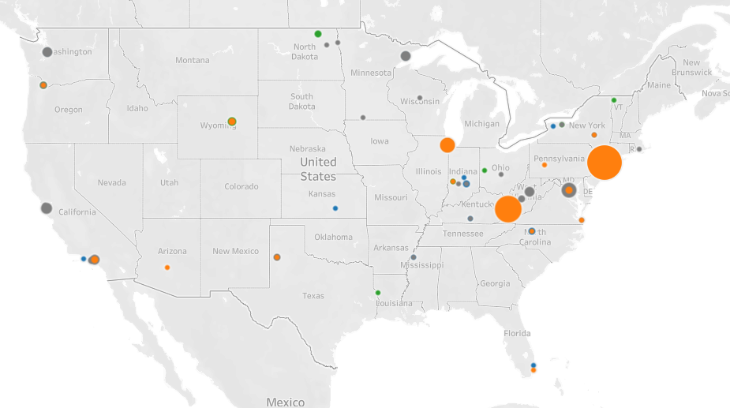

# Company Tweets Sentiment Analysis and Visualization

This project focuses on analyzing the sentiment of tweets related to a specific company. By leveraging Tableau for data visualization, the project aims to present insightful visualizations that help understand the sentiment trends, patterns, and other relevant metrics over time.

## Project Overview

The objective of this project is to perform sentiment analysis on a collection of tweets and visualize the results using Tableau. The analysis aims to uncover insights into public opinion and sentiment towards the company, as expressed through social media.

## Features

- **Sentiment Analysis**: The project includes sentiment scores assigned to each tweet, indicating whether the sentiment is positive, negative, or neutral.
- **Data Visualization**: Using Tableau, various visualizations have been created to display sentiment trends, distribution, and key metrics over time.
- **Interactive Dashboard**: An interactive Tableau dashboard allows users to explore the data and gain insights through filters and other interactive elements.

## Files Included

- `CompanyTweets.twbx`: A Tableau workbook containing the visualizations and dashboards created for the project.
- `SentimentScores.csv`: A CSV file with the sentiment scores for each tweet, including metadata such as tweet date and content.
- `words.txt`: A text file containing words or phrases relevant to the sentiment analysis.

## Technologies Used

- **Tableau**: For data visualization and interactive dashboards.
- **Python (optional)**: If Python was used for sentiment analysis or data preprocessing (not included in the repository but can be mentioned if applicable).
- **CSV**: For storing and handling structured data.

## Getting Started

To explore the visualizations:

1. **Install Tableau**: Make sure you have Tableau installed on your system. You can download it from the [official Tableau website](https://www.tableau.com/).
2. **Open the Tableau Workbook**:
    - Open `CompanyTweets.twbx` using Tableau.
    - Explore the pre-built dashboards and visualizations.
3. **Analyze the Data**:
    - Use the interactive features within Tableau to filter data, zoom into specific time frames, or focus on particular sentiment scores.

## Usage

This project can be used by data analysts, marketers, and company executives to understand public sentiment towards a brand or company. The visualizations provide insights into how sentiment changes over time, helping to inform marketing strategies, customer service responses, and more.

## Contributing

If you'd like to contribute to this project, please fork the repository and use a feature branch. Pull requests are welcome.

## License

This project is licensed under the MIT License - see the `LICENSE` file for details.

## Contact

If you have any questions, feel free to reach out to the project maintainers.

---

**Note**: Ensure that all sensitive data is removed or anonymized before sharing or uploading to public repositories.
